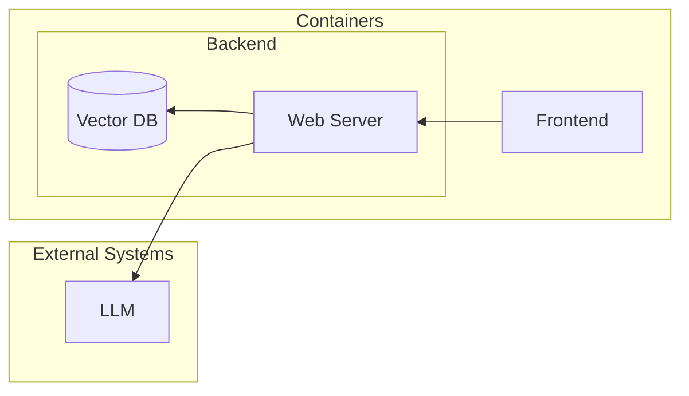

# Architecture

This file goes over the current architecture of this prototype. Keep in mind that given the limited scope of the prototype, there are a number of design decisions which would not be ideal in a production-ready system. These are highlighted in the [Potential Improvements](./Potential-Improvements.md) document.

## System Overview

The diagram above shows the current architecture of the prototype. The system is composed of three components:
- **OpenAI**: In order embed the review data into vectors which can be used to search through their contents, as well as to implement an AI assistant which can answer questions about the data, we need to access a pre-trained Large Language Model. OpenAI provides an API which allows us to access both embedding as well as chat completion models. This is an external service and therefore not implemented in this project, but nevertheless a critical component of the system.
- **Backend**: The backend component takes a number of different roles:
  - This component hosts the Vector DB where the embedded review data will be stored and accessed from.
  - A web server is implemented in Python to provide endpoints which can be used to interact with the Vector DB. This includes embedding and indexing new data, as well as performing search queries.
  - A LangGraph agent is implemented to provide the chat functionality of the AI assistant with access to the search functionality of the Vector DB. This agent is set up in such a way to support a multi-agent network that could potentially take care of different tasks.
  - The web server also implements an HTTP endpoint which can be used to interact with the LangGraph agent.
- **Frontend**: The frontend component is a React application which provides a user interface to interact with the backend.

In the following sections we go into more detail about the different components and how they interact with each other.

## OpenAI

Nowadays, the available selection of LLM providers is quite large. On top of that, most of them have implemented their API using a standard interface, which makes it quite easy to switch between providers and build systems which can support multiple of them.

However, for the sake of simplicity for this prototype, we have decided to select one single provider. [OpenAI](https://platform.openai.com/) was chosen for this purpose as it is arguably the most well-known and widely used provider of LLMs, and the chances are very high that the individuals reviewing this prototype will already have access to their own API key.

## Backend

As the [system overview](#system-overview) section explains, this component actually takes care of a rather high number of responsibilities. While this would not be ideal in a production-ready system with potential of growing quite large in complexity, it was decided to follow the provided description for the prototype literally and implement this as a single component. This was done to save on time, and because the scope of the prototype is so simple that there would not be any immediate benefits to splitting it up.

### Vector DB

As per the prototype's description, the system is required to implement a vector database where a number of documents are stored in an embedded form. This is done to allow for fast and efficient search queries to be performed on the data.

The technology selected to implement this database is [Chroma](https://www.trychroma.com/). This is a very simply open-source vector database with libraries that make it straight-forward to interact with it from a any programming language, and easy to set up and run using Docker.

For a production-ready environment would require that the database is hosted in its own dedicated container, storing its data in a persistent volume. However, for the sake of simplicity in this prototype, this database runs in the same container.

We have decided to use [LangChain's Python API](https://python.langchain.com/docs/integrations/vectorstores/chroma/) to communicate with Chroma, instead of directly leveraging its own Python API. This has also been done for the sake of simplicity, as this is a higher-level interface which also takes care of embedding the data before storing it in the database.

This approach also makes it easier to migrate to a different Vector DB provider in the future, without having a large impact on the codebase.

As for the embedding of documents (and therefore also the queries), we have decided to use OpenAI's `text-embedding-3-small` model. This is a small, fast and cheap model, which is ideal for a prototype like this, where accuracy is not the main concern.

### AI Assistant

The AI assistant that will search through the data and provider answers to questions is implemented using [LangGraph](https://langchain-ai.github.io/langgraph/tutorials/introduction/). This is LangChain's implementation of a multi-agent LLM framework, which allows us to create complex yet scalable AI solutions capable of handling a wide range of tasks.

However, due to the simplicity of the prototype, our graph is currently composed of a single agent with access to a single tool which can query the vector database. The code, however, has been set up in such a way that expanding this graph with additional agents would be a simple task which would not affect the overall interface of the system.

LangChain was chosen over other frameworks like Microsoft's [AutoGen](https://microsoft.github.io/autogen/stable/) for the sake of experimentation. While my personal familiarity with AutoGen is higher, I considered it an opportunity to try out an alternative.

### Web Server

The web server that exposes the backend's functionality to the front-end has been implemented using [FastAPI](https://fastapi.tiangolo.com/). This is a modern Python web framework which is designed to be fast to develop with, and to provide a high-performance API, and is recently becoming more popular than the more traditional Flask and Django frameworks.

This server provides endpoints to communicate with the Vector DB, making it possible to add new data to it and to perform search queries.

Additionally, it provides an endpoint which can be used to interact with the LangGraph agent. This endpoint follows the same interface as the [chat completions API](https://platform.openai.com/docs/api-reference/chat/create) provided by OpenAI. This has become the industry standard for LLM chat interfaces, and makes it possible to use any libraries that handle OpenAI LLMs directly to interact with our assistant.

The OpenAI API takes parameters that allow selection of the exact model to use as well as the access key to the API. This moves the responsibility of selecting the exact underlying model to the consumer of the API. While it might be strange that the backend component has its own key and selects the embedding model for the vector database, but outsources this responsibility when it comes to the AI assistant, this choice makes more sense when we consider that in a production environment the vector database's service should be decoupled from the AI assistant's service.

The embeddings used for the vector database are meant to be more static, as a different model would make the previously embedded data unusable. However, an AI assistant's service should ideally be stateless, as their implementations are generally complex, so it makes more sense to avoid obfuscating its implementation with state management, and instead outsource that responsibility for the consumer of the API. This also means that the assistant's service should make as few decisions outside of the agent's architecture as possible.

## Frontend

The frontend component is a [React](https://react.dev/) application which has been built using the [Next.js](https://nextjs.org/) framework with TypeScript. On top of that, we are leveraging Vercel's [AI SDK](https://sdk.vercel.ai/docs/introduction) library to implement the communication with the LLM. This combination of technologies makes it very easy to set up a chat UI which we can use to interact with our AI assistant. Since our assistant uses an API compatible with OpenAI's, we don't even need to build a custom connector for the AI SDK to use it.

The chat is also implemented using streaming, which makes it possible to receive the responses from the assistant in real-time as they are generated. This provides a more interactive experience for the user, as they can see the assistant "thinking" as it generates the responses.

The frontend's UI has been built using [DaisyUI](https://daisyui.com/), a Tailwind CSS component library which makes it easy to build beautiful and responsive UIs with minimal effort. We have modified the default theme to use Riverflex's brand color to make the UI consistent with the company's branding.

## Containerization

Both the frontend and backend components are containerized using [Docker](https://www.docker.com/). This makes it easy to set up the development environment, as well as to deploy the application to a server. The `compose.yaml` file in the root of the project brings everything together, making it possible to start the entire system with a single command.

Because of this, the system can run anywhere where the Docker engine is available, and the only requirement is that the OpenAI API key is available in the environment.
