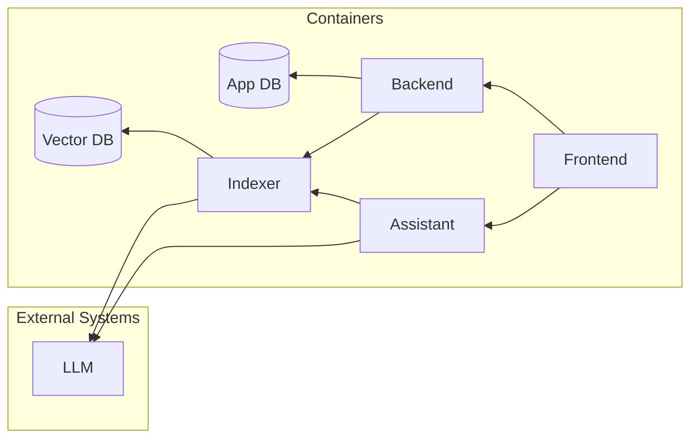

# Potential Improvements

This document briefly describes the most obvious changes that would be required to this prototype if it were to be converted into a production-ready system.

To understand this in context, please look at the current [Architecture](./Architecture.md) of the prototype before reading this document.

## Architecture

The diagram above shows the ideal architecture for such a system in the case that it would be converted into a production-ready environment. The changes made ensure that the system is scalable, making it easier to manage the addition of new features and components in the future.

The components of the system are as follows:
- **LLM**: This external system remains the same as in our current architecture. However, we should consider that a production-ready system might need to support different providers.
- **Vector DB**: The modified architecture hosts the vector database using a dedicated container. This container should have a volume mounted to store the data persistently in a safe location. While data can be re-embedded and re-indexed, this can be an expensive operation both in terms of time and money, depending on the amount of data. Because of that, we want to avoid losing data unnecessarily. On top of that, we want to avoid having to share the same hardware resources directly between the vector database and other components.
- **Application DB**: The current prototype does not store any data besides the document embeddings. However, it is very likely that the application would eventually need to store more information. This includes conversation states, making it possible to resume chats from previous sessions, as well as any other kind of data that would be relevant for the requirements. This should not be stored in the vector database, and instead a more traditional application database (either relational or NoSQL) should be used. Of course, this database should also be hosted on a dedicated container or service. 
- **Indexer**: Communication with the vector database needs to be abstracted using a web service. This will abstract the interface with the database itself, and make it possible to add logic for security and data consistency. While the current implementation combines everything into a single "backend", we would ideally separate the service that handles the vector database into a dedicated container.
- **Assistant**: AI assistant component can potentially become quite complex, as the number of agents and tools grow. For this reason, it makes sense to separate this component into a separate dedicated container. This container should be stateless, in order to outsource that additional complexity to other components. It simply should provide a kind of "filter" between the application and the underlying LLM, with tools that can access information from the vector database (through the indexer) as well as any potential additional services.
- **Backend**: The application's backend proper, should therefore not contain the assistant logic directly, nor the indexer logic. While the current version of the prototype does not have any functionality that would need to be implemented here directly, it is certain that a production version of the application would require to handle additional data and therefore require additional business logic (e.g. managing conversation state). This component will therefore serve as the middleman between the frontend and the other components (like the application database, the indexer... etc.). This allows us to reduce the complexity of the frontend itself, as well as to dedicate a central place to ensure data integrity and security.
- **Frontend**: The frontend component would remain largely the same. This component should implement as little business logic as possible, and instead rely on the backend to provide the necessary data and functionality. Do notice how the frontend directly communicates with the AI assistant instead of rerouting this communication through the backend. This is because we ideally want to stream the output of the LLM directly to the frontend, and that would become cumbersome if we would add another additional layer of communication. Nonetheless, the frontend would use the backend to store or retrieve conversation history.

## Additional Improvements

### Authorization and Authentication

Currently, no authorization or authentication is implemented. This is a critical feature that should be implemented in a production-ready system. A simple approach would be to leverage a third-party identity provider like Microsoft Entra ID, Google or Auth0. This would allow users to log in user their own accounts, and protect the application from unauthorized access.

### Indexer

The process of adding new data to the vector database could be improved in a number of ways:
- **Data chunking:** Currently, the documents are rather small, making it possible to embed each one into a single vector. In reality, documents tend to be quite large. This requires them to be split into chunks which are them embedded separately. The actual chunking approach is highly dependent on the type of document. If possible, each chunk should be meaningful, although in some cases it will not be possible to split documents cleanly, and it will be needed to have overlapping chunks containing more or less arbitrary sections of the parent document.
- **Additional fields:** The current version of the prototype only embeds the main text of the document, and only searches through that text. A more complex system would be likely to support searching the documents using different conditions (e.g. based on labels, dates... etc.) or different text fields, like summaries or titles.

### Assistant

As mentioned before, the assistant is currently a very simple, single agent graph. Due to the ambiguity of the requirements, its instructions are extremely simple. However, in a production-ready system, it is likely that the assistant would need to be able to handle more complex instructions, and potentially even multiple agents, each using different tools to carry out different operations.

We might want to return more structure response to the user, making using specific markdown or HTML strings, or using structured data formats like JSON which the front-end would then need to render into visuals.

### Frontend

The frontend currently displays messages only in the form of text. If the output of the assistant would be more complex, we would need to implement additional logic and visuals to handle this. Think of specific message bubbles that display reviews with additional information and links to other pages... etc. 

If the assistant would become a multi-agent system, we might also want to implement configuration settings that would allow users to show or hide output from specific agents, or even disable them completely if they are not needed in a conversation.

### State Management

It is almost certain that requirements to store conversation states will arise. This is necessary to allow users to resume conversations from previous sessions, or to store additional information that is relevant to the conversation. This information should not be stored in the vector database, but in a more traditional application database.

This would require the logic to manage that to be implemented in the backend. The assistant's OpenAPI compatible API takes as an input a list of previous messages, so it would be up to the front-end to retrieve the previous messages from the backend, load them into memory, and then send them to the assistant when the user sends a new message.